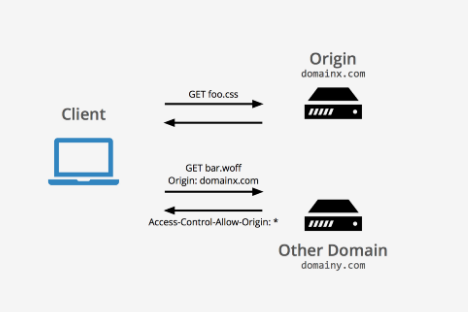
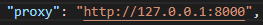
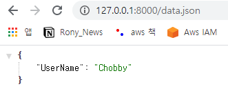
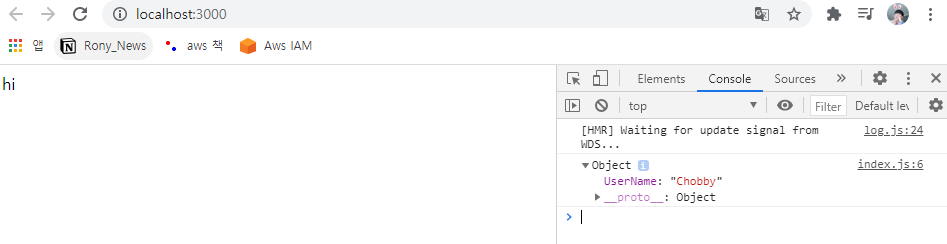

# What is CORS ?

많은 개발환경에서 React App 을 3000번 포트로 틀고 ,
서버를 다른 포트로 틀어 정보를 주고 받는다.

하지만



같은 localhost 환경일지라도 , 포트번호가 다르거나 다른 도메인 주소로 값을 주고받는 것을 CORS 라는 체재로 막고있다.

# React Proxy

React Proxy 를 사용하면 해당 정책을 우회할 수 있는데,



위의 이미지와 같이 Create React App 의 Package.json 에 json 형식으로 proxy 와 원하는 우회 주소를 입력해주면 된다.

즉 , 원래는

```javascript
const testData = async () => {
	console.log(await fetch('http://locahost:8000/data.json').then((res) => res.json()));
};
```

로 접근할 수 있었던 fetch문이

```javascript
const testData = async () => {
	console.log(await fetch('/data.json').then((res) => res.json()));
};
```

위와같이 바꿀 수 있게 되는것이다.

# 실제 구동



위와같이 8000번 포트에 데이터를 띄워준 후



해당 사진과 같이 3000번 포트에서도 정보를 불러올 수 있다.
